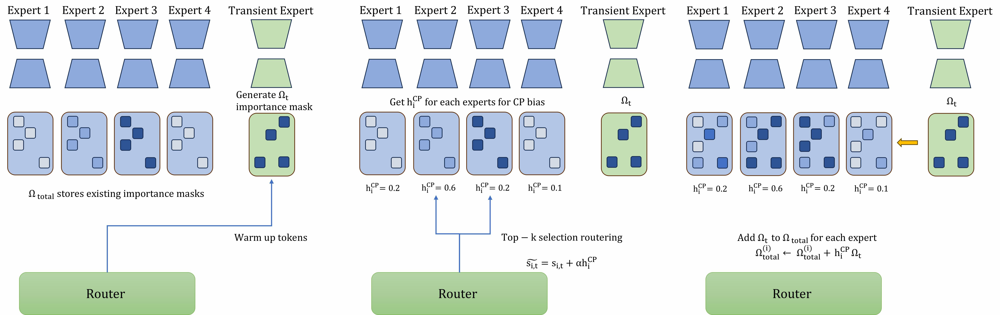

# CP-MoE: Consistency-Preserving Mixture-of-Experts

**Published at the 5th Conference on Lifelong Learning Agents (CoLLAs), 2026.**

CP-MoE is a post-training framework for continually fine-tuning large foundation models on a sequence of tasks without catastrophic forgetting. The foundation model stays frozen; CP-MoE governs how LoRA-based experts are updated and routed as new tasks arrive.

## The Core Problem

When large language models (LLMs) and vision-language models (VLMs) adapt to new tasks sequentially, parameter-efficient fine-tuning with LoRA is the standard choice. But efficiency does not prevent forgetting: each new task still tends to overwrite what the model already knew. Low-Rank Adaptation Mixture-of-Experts (LoRA-MoE) is a more natural fit for this setting, since a partitioned parameter space gives some isolation for free. Yet two of its default mechanisms work against continual learning:

- **Load balancing fights task placement.** Balancing objectives force experts to share tokens evenly. This is what prevents expert collapse in pretraining, but in continual learning the same pressure keeps pushing new tasks into experts that already hold old knowledge.
- **Updates are blind to what matters.** Stable experts are updated directly from the current task's gradients, with no notion of which parameters carry knowledge worth keeping.

## Method

CP-MoE addresses both issues by first probing each new task with a temporary expert, then using what it learns to guide how the stable experts are routed and updated:



*Overview of CP-MoE. (Left) A task-specific transient expert is optimised on warm-up tokens to derive the prospective importance mask Ω<sub>t</sub>. (Middle) CKA between the transient expert and each stable expert produces representation-consistency scores h<sub>i</sub><sup>CP</sup>, injected as a routing bias so load-balancing pressure does not override expert specialisation. (Right) After training, Ω<sub>t</sub> is accumulated into each expert's importance matrix, weighted by h<sub>i</sub><sup>CP</sup>, so experts aligned with the current task receive prioritised parameter protection.*

- **Transient Expert** — a temporary expert module that captures early, task-specific updates during the initial phase of a new task and is discarded afterwards.
- **Consistency-Preserving Routing Bias** — the transient expert is used to measure representation similarity between the new data and the existing stable experts, steering routing toward the most compatible stable experts.
- **Transient Expert-Guided Regularisation** — when the stable experts are updated, the mechanism identifies which historical parameters are most critical and applies targeted regularisation to shield them from being overwritten.

## Results

Evaluated on frozen 7B backbones (Llama-2-7B for language, LLaVA-1.5-7B for vision-language), training only the LoRA experts and router (1.48% of parameters on SuperNI, 0.47% on VQA v2):

| Benchmark | Setting | CP-MoE | Strongest baseline |
| --- | --- | --- | --- |
| SuperNI | 8 sequential language tasks | **50.84%** avg / **1.32%** forgetting | 51.54% (GainLoRA) |
| SuperNI | zero-shot transfer, 7 unseen tasks | **35.80%** | 33.80% (GainLoRA) |
| VQA v2 | 10 sequential visual-reasoning tasks | **62.30%** avg / **0.35%** forgetting | 60.77% / 1.77% (CL-MoE) |

## Install

```bash
conda create -n cpmoe python=3.10 -y
conda activate cpmoe
pip install -e .
pip install -e ".[train]"
pip install flash-attn --no-build-isolation
```

## Data

SuperNI tasks, one folder per task:

```
SuperNI/<task_name>/train.json
SuperNI/<task_name>/test.json
```

## Training

Each task has its own script under `scripts/LoraMoE/Train_NI/`. Train tasks sequentially
in order (the output of one task is the init for the next):

```bash
# single task
bash scripts/LoraMoE/Train_NI/1_task1572.sh

# full continual-learning order (task 1 → 15)
bash scripts/LoraMoE/Train_NI/Train.sh
```

Key arguments (set inside each script):

| Arg | Meaning |
| --- | --- |
| `--expert_num` | number of LoRA experts (default 8) |
| `--lora_r` / `--lora_alpha` | LoRA rank / alpha |
| `--cka_beta` | router CKA bias weight |
| `--use_cka_mask` | weight expert-mask update by CKA similarity (default `True`; set `False` to ablate) |
| `--warmup_tokens` | task-embedding warmup token budget |
| `--lora_target_modules` | modules to inject LoRA into |

Checkpoints are written to `--output_dir` (e.g. `./checkpoints/CL4VQA/<task>/...`).

## Evaluation

Each task has a matching eval script under `scripts/LoraMoE/Eval_NI/`.
Usage: `bash <script> <stage> <model_path> <cka_beta>`.

```bash
# single task
bash scripts/LoraMoE/Eval_NI/1_task1572.sh Finetune ./checkpoints/CL4VQA/task1572/llama-2-7b-hf-lora 0.2

# evaluate all tasks
bash scripts/LoraMoE/Eval_NI/Eval_all.sh
```

Each script runs multi-GPU inference (uses `CUDA_VISIBLE_DEVICES`), merges the
shards, and scores with `llava/eval/CLMoE/eval_superni.py`. Results and the
`accuracy_result.txt` land in `./results/CLMoE/<task>/<stage>/`.

## License

Released under the [MIT License](LICENSE).

## Acknowledgement

Built on [LLaVA](https://github.com/haotian-liu/LLaVA) and [CL-MoE](https://github.com/ECNU-ICALK/CL-MoE).
